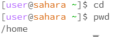

## Lab 1

1. cd:
   
  No arguments:

  

  The working directory is /home when the command was run. "cd" does not have any arguments so it will just change the working directory to home. Therefore, pwd will demonstrate this change by giving /home as an output.  The output is not an error. 

2. 
