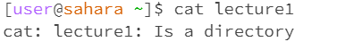
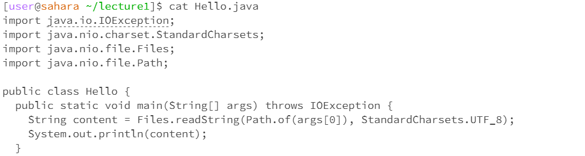

## Lab 1

## 1. cd
   
  **No arguments:**

  

  The working directory is /home when the command was run. "cd" does not have any arguments so it will just change the working directory to home. Therefore, pwd will demonstrate this change by giving /home as an output.  The output is not an error. 

**Command with a path to a directory as an argument:**

  

  The working directory was /home when the command was run. The output was /home/lecture1 because cd made lecture1 the working directory, which is under /home. The output is not an error. 

  **Command with a path to a file as an argument:**
  
  
  
The working directory was /home when the command was run. I received this output because I used Hello.java as if it were a directory. Therefore, the output is an error because Hello.java is a file when cd expected a directory as an argument. 

## 2. ls

   **No arguments:**

   

The working directory was /home/lecture1 when the command was run. I got this output because there are no arguments, therefore ls will list what is within the current working directory. The output is not an error. 

**Command with a path to a directory as an argument:**

  

  The working directory was /home when the command was run. I got this output because ls shows what is inside the lecture1 directory. The output is not an error.

 **Command with a path to a file as an argument:**

   

The working directory was /home/lecture1 when the command was run. I got this output because ls will list the file inside the directory that was inputted as the argument. The output is not an error. 

## 3. cat

  **No arguments:**

   

   The working directory was /home/lecture1 when the command was run. There is a blank output because there was no argument, there cat gives back the contents of the argument, which is also blank. The output is not an error.

**Command with a path to a directory as an argument:**

  

  The working directory is /home when the command is run. The output resulted from lecture1 being a directory. As a result, this is an error because cat is unable to show the contents from a directory. 

 **Command with a path to a file as an argument:**

   
  
The working directory was /home/lecture1 when the command was run. I got this output because the cat command showed me what is within the Hello.java file. The output is not an error.
