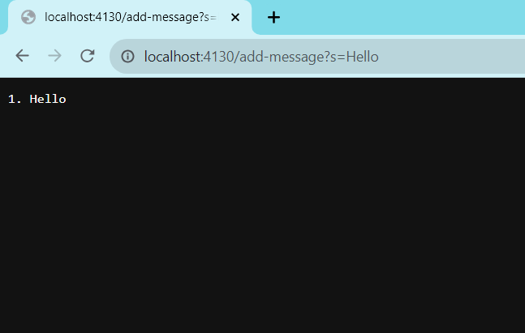
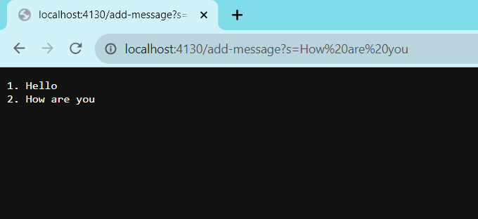

## Lab 1

## 1. Code for StringServer

The code from the previous NumberServer was referenced and adjusted for this assignment. 

**First Message:**

The methods called are handleRequest(URI url) and handle(final HttpExchange exchange). The relevant arguments that result in this screenshot are URI url with /add-message and the query s=Hello. The relevant fields are messageNumber which has a value of 0 and runningString which is empty. After running the request, messageNumber is changed to 1 and running String gets 1. Hello added. 

**Second Message:**

The methods called are handleRequest(URI url) and handle(final HttpExchange exchange). The relevant arguments that result in this screenshot are URI url with /add-message and the query s=How are you. The relevant fields are messageNumber which has a value of 1 and runningString which is 1. Hello. After running the request, messageNumber is changed to 2 and running String is now 1. Hello 2. How are you. 

## 2. What I Learned

I learned how to run a server on my local computer during this lab. At first, I had trouble navigating VS Code, but now I feel confident using this application in the future. Furthermore, I learned how to insert the requests in the URL, which was new to me. 
