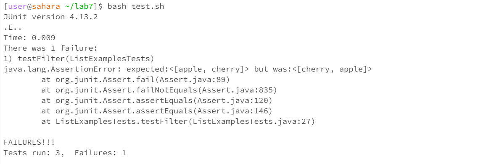
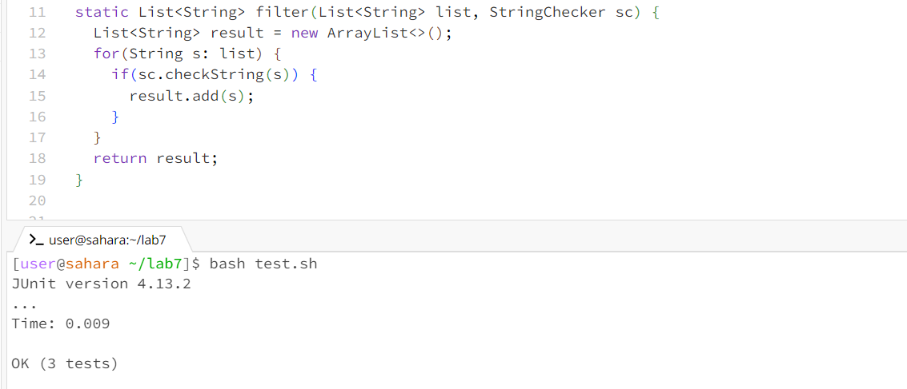

# Lab 5

- The code used was edited from Week 7: https://github.com/ucsd-cse15l-s23/lab7
  
## 1. Message from student
The student's post would explain a problem with the filter method in their ListExampples class. It seems to have the order of the elements reversed in the output. 

This is one of the tests written to catch any issues:

```
@Test
public void testFilter() {
    List<String> input = Arrays.asList("apple", "banana", "cherry");
    List<String> expected = Arrays.asList("apple", "cherry");
    List<String> result = ListExamples.filter(input, s -> s.startsWith("a") || s.startsWith("c"));
    assertEquals(expected, result);
}
```
However, the test failed with this output: 

  


## 2. Response from TA
- The TA can then ask the student to check how the elements are added to the result list, which can lead to this output.


## 3. 
This is the part of the code that the student would check as the TA suggested. 

```
static List<String> filter(List<String> list, StringChecker sc) {
    List<String> result = new ArrayList<>();
    for(String s: list) {
      if(sc.checkString(s)) {
        result.add(0, s); 
      }
    }
    return result;
  }
```
Revised with test passing:
  

The student would find that the elements are being added to the start of the result list, which reverses their order. 

## 4. 
Before: 
ListExamples.java
```
import java.util.ArrayList;
import java.util.List;

interface StringChecker { boolean checkString(String s); }

class ListExamples {

  // Returns a new list that has all the elements of the input list for which
  // the StringChecker returns true, and not the elements that return false, in
  // the same order they appeared in the input list;
  static List<String> filter(List<String> list, StringChecker sc) {
    List<String> result = new ArrayList<>();
    for(String s: list) {
      if(sc.checkString(s)) {
        result.add(0, s);
      }
    }
    return result;
  }


  // Takes two sorted list of strings (so "a" appears before "b" and so on),
  // and return a new list that has all the strings in both list in sorted order.
  static List<String> merge(List<String> list1, List<String> list2) {
    List<String> result = new ArrayList<>();
    int index1 = 0, index2 = 0;
    while(index1 < list1.size() && index2 < list2.size()) {
      if(list1.get(index1).compareTo(list2.get(index2)) < 0) {
        result.add(list1.get(index1));
        index1 += 1;
      }
      else {
        result.add(list2.get(index2));
        index2 += 1;
      }
    }
    while(index1 < list1.size()) {
      result.add(list1.get(index1));
      index1 += 1;
    }
    while(index2 < list2.size()) {
      result.add(list2.get(index2));
      // change index1 below to index2 to fix test
      index1 += 1;
    }
    return result;
  }


}
```

ListExamplesTest.java :

```
import static org.junit.Assert.*;
import org.junit.*;
import java.util.*;
import java.util.ArrayList;


public class ListExamplesTests {
	@Test(timeout = 500)
	public void testMerge1() {
    		List<String> l1 = new ArrayList<String>(Arrays.asList("x", "y"));
		List<String> l2 = new ArrayList<String>(Arrays.asList("a", "b"));
		assertArrayEquals(new String[]{ "a", "b", "x", "y"}, ListExamples.merge(l1, l2).toArray());
	}
	
	@Test(timeout = 500)
        public void testMerge2() {
		List<String> l1 = new ArrayList<String>(Arrays.asList("a", "b", "c"));
		List<String> l2 = new ArrayList<String>(Arrays.asList("c", "d", "e"));
		assertArrayEquals(new String[]{ "a", "b", "c", "c", "d", "e" }, ListExamples.merge(l1, l2).toArray());
        }

@Test
public void testFilter() {
    List<String> input = Arrays.asList("apple", "banana", "cherry");
    List<String> expected = Arrays.asList("apple", "cherry");
    List<String> result = ListExamples.filter(input, s -> s.startsWith("a") || s.startsWith("c"));
    assertEquals(expected, result);
}

}
```
test.sh :
```
javac -cp .:lib/hamcrest-core-1.3.jar:lib/junit-4.13.2.jar *.java
java -cp .:lib/hamcrest-core-1.3.jar:lib/junit-4.13.2.jar org.junit.runner.JUnitCore ListExamplesTests
```


Files and directory: 
lab7/
│
├── lib/
│   
│
├── ListExamples.class
│
├── ListExamples.java
│
├── ListExamplesTests.class
│
├── ListExamplesTests.java
│
├── StringChecker.class
│
└── test.sh

- To trigger the bug I ran the test using ``bash test.sh``
- To fix the bug I changed result.add(0, s); to result.add(s); in the ListExamples filter to have the expected order of elements.


# Part 2

- During this part of the quarter I learned a lot about making edits from the command line. I did not realize there are many keyboard shortcuts that can really speed up the process of editing files with enough practice. I also found it cool to access
-  my Github account from the command line as well which I did not know was possible before. Additionally, I learned more about the TAs through conversation and learned about their experiences in undergrad and attending grad school. 
