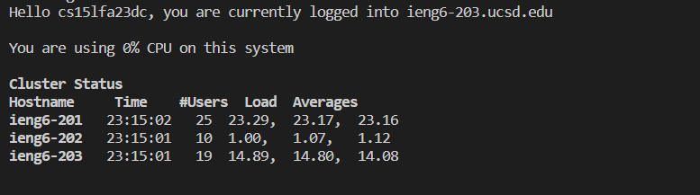
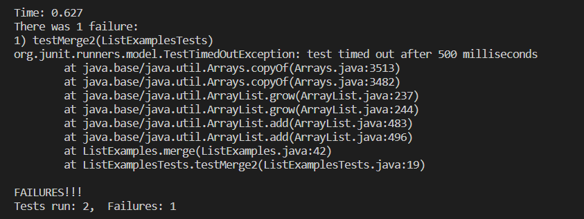
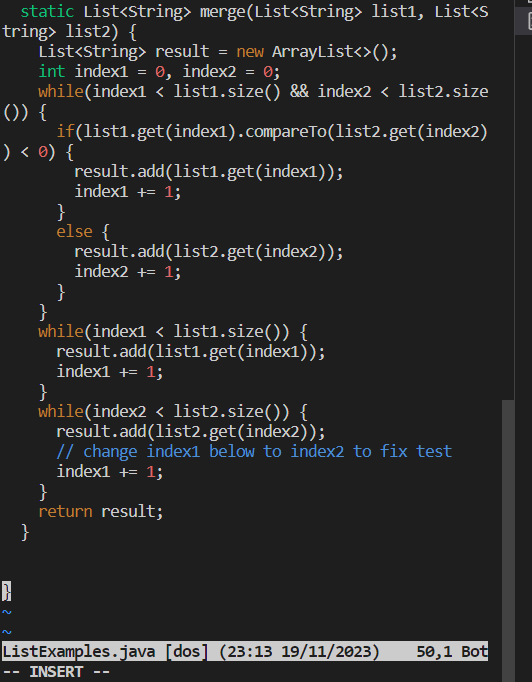
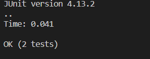
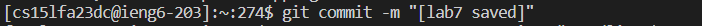

# Lab 4

## 4. Login:

 

- ssh cs15lfa23dc@ieng6.ucsd.edu
- keystrokes:
s s h c s e 1 5 l f a 23 d c '<shift>' 2 i e n g 6 . u c s d . e d u `<enter>`
  
 -This allows me to log into my account remotely.

  ## 5. Clone:

```
git clone git@github.com:j1noriega/lab7.git
cd lab7
```
- Key strokes: g i t c l o n e : The command allows to copy a repository.
g i t @ g i t h u b .com:j 1 n o r i e g a / l a b 7 .git: This input leads me to the exact repository that I am looking for. 
<enter>: Executes the command.
- This allows me to clone the repository that I forked on my personal github account and then navigate to the file. 


 ## Test Fail: 

  

 ``bash test.sh 
 ``
Key strokes: b a s h t e s t . s h `<enter>`
 - Running this command allows me to quickly run the tests that are on ListExamplesTests.java

## Editing on vim
  

  `` vim ListExamples.java
  ``
   - Key strokes: v i m `<shift>` l i s t `<shift>` e x a m p l e s . j a v a `<enter>`
   - :44 used to jump to the line 44 where the edit needs to be made
   - Right `<arrow key>` 8 times - reach position after 1
   - `<backspace>` - delete the 1
   - '2' - insert correct value
   - :wq save and quit the editor

## Test Passed:
  
  
 ``bash test.sh 
 ``
 - this is used to run the test once again
 - 
## Saved: 
 
 
``` 
git remote add origin git@github.com:j1noriega/lab7.git 
git push origin main
```

- After making changes i can commit and push
